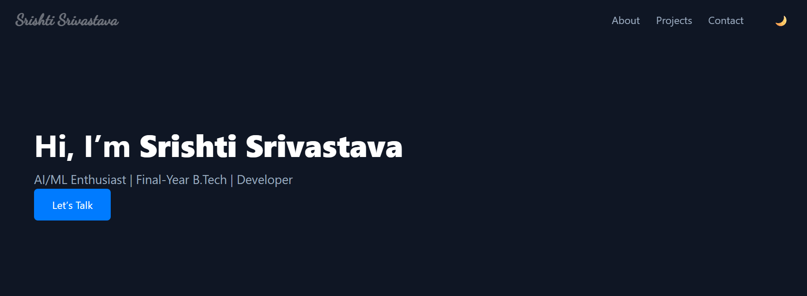

# Portfolio
Portfolio website
# 💻 Srishti Srivastava | Developer Portfolio

A modern, dark-themed portfolio website to showcase my skills, projects, and contact information. Built using **HTML, CSS, JavaScript**, and **Flask (Python)**. It includes a typing animation, dark mode toggle, and stores contact form data in a CSV file.


---

## 🧩 Tech Stack

### Frontend:
- HTML5
- CSS3 (Dark Theme, Responsive)
- JavaScript (Typing effect, Dark mode toggle)

### Backend:
- Python 3
- Flask (Minimal web framework)
- CSV module (for saving contact form data)

---

## 🎯 Features

-  Responsive dark-themed layout
-  Typing effect with blinking cursor
-  Project cards with GitHub links
-  Contact form that:
  - Prints data to console
  - Saves submissions to `contact_data.csv`

---

## 🖼️ Screenshots

 <!-- Optional -->

---

## 📂 Project Structure
```
portfolio/
│
├── app.py # Flask backend
├── contact_data.csv # Stores contact form submissions
│
├── templates/
│ └── index.html # Main HTML file
│
├── static/
│ ├── css/
│ │ └── style.css # Styling
│ ├── js/
│ │ └── script.js # Typing + dark mode JS
```

## 🚀 Run Locally

### 1. Clone the Repository

```bash
git clone https://github.com/SrishtiSrivastava23/portfolio.git
cd portfolio

│ └── resume.pdf # Your downloadable resume
```

2. Set Up Python Environment

```bash
pip install flask
```

4. Run the Server

```bash

python app.py
```

📝 Contact Form Handling
Submissions are stored in contact_data.csv

If the file doesn’t exist, it is created automatically

Each row includes: Name, Email, Message

👩‍💻 Author
Srishti Srivastava
